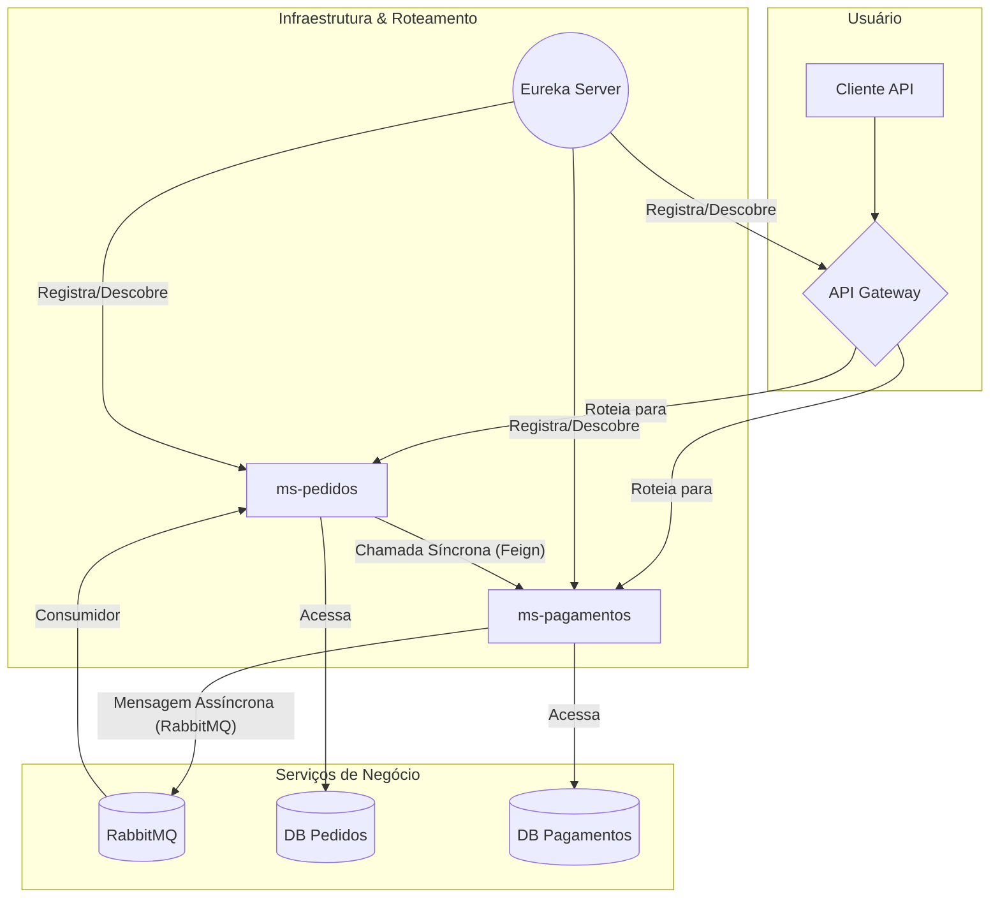

# Sistema de Delivery - Arquitetura de Microsserviços

Este projeto implementa um sistema de backend para delivery utilizando uma arquitetura de microsserviços com Java e Spring Cloud. O objetivo é demonstrar a separação de responsabilidades, a comunicação entre serviços e a resiliência de um sistema distribuído.

## Tecnologias Principais

- **Java 21**
- **Spring Boot 3**
- **Spring Cloud**
- **Maven**
- **MySQL** (Banco de Dados)
- **RabbitMQ** (Mensageria)
- **Docker** (Ambiente de Desenvolvimento)
- **OpenAPI (Swagger)** (Documentação de API)

---

## Arquitetura

O sistema é composto por quatro microsserviços principais que trabalham em conjunto:



### Componentes

1.  **Eureka Server (`eureka`)**
    - **Responsabilidade:** Service Discovery (Registro e Descoberta de Serviços).
    - **Detalhes:** Todos os outros microsserviços se registram no Eureka ao iniciar. Isso permite que eles se encontrem na rede sem a necessidade de hardcoding de IPs ou portas, facilitando a escalabilidade e a resiliência.

2.  **API Gateway (`gateway`)**
    - **Responsabilidade:** Ponto de entrada único para todas as requisições externas.
    - **Detalhes:** Utiliza o Spring Cloud Gateway para rotear o tráfego para os microsserviços apropriados. Ele se integra ao Eureka para descobrir dinamicamente as localizações dos serviços, atuando também como um **Load Balancer** (balanceador de carga) no lado do cliente para distribuir as requisições entre múltiplas instâncias de um mesmo serviço.

3.  **Microsserviço de Pedidos (`ms-pedidos`)**
    - **Responsabilidade:** Gerenciar todo o ciclo de vida dos pedidos (CRUD de Pedidos e Itens).
    - **Comunicação:**
        - Expõe uma API REST para operações de CRUD.
        - Consome mensagens da fila do RabbitMQ para receber atualizações de status de pagamento.

4.  **Microsserviço de Pagamentos (`ms-pagamentos`)**
    - **Responsabilidade:** Processar e gerenciar os pagamentos dos pedidos.
    - **Comunicação:**
        - Expõe uma API REST para operações de CRUD e confirmação de pagamento.
        - Publica mensagens no RabbitMQ quando um pagamento é criado.
        - Realiza chamadas síncronas para o `ms-pedidos` via OpenFeign para notificar a confirmação de um pagamento.

---

## Padrões de Comunicação

O projeto demonstra dois padrões de comunicação entre serviços, cada um usado em um contexto apropriado.

### 1. Comunicação Síncrona (Request-Response)

- **Tecnologia:** OpenFeign
- **Fluxo:** `ms-pagamentos` -> `ms-pedidos`
- **Caso de Uso:** Quando um pagamento é confirmado através do endpoint `PATCH /pagamentos/{id}/confirmar`, o `ms-pagamentos` precisa notificar **imediatamente** o `ms-pedidos` para que o status do pedido seja atualizado para `PAGO`.
- **Implementação Notável (Padrão Saga):** Se a chamada síncrona para o `ms-pedidos` falhar, o `PagamentoService` captura a exceção e **reverte** o status do pagamento. Isso garante que os dados não fiquem em um estado inconsistente, uma prática robusta para gerenciar transações distribuídas.

### 2. Comunicação Assíncrona (Event-Driven)

- **Tecnologia:** RabbitMQ
- **Fluxo:** `ms-pagamentos` -> `Fila RabbitMQ` -> `ms-pedidos`
- **Caso de Uso:** Quando um novo pagamento é criado (`POST /pagamentos`), o `ms-pagamentos` publica uma mensagem na fila `pagamento.concluido`. Ele não precisa esperar por uma resposta, o que desacopla os serviços.
- **Vantagens:** Aumenta a resiliência. Se o `ms-pedidos` estiver offline, a mensagem permanecerá na fila para ser processada quando o serviço voltar a ficar disponível.

---

## Documentação da API (Swagger)

Cada microsserviço de negócio expõe sua própria documentação de API usando OpenAPI (Swagger). Após iniciar os serviços, você pode acessar a UI do Swagger através do API Gateway:

- **API de Pedidos:** [http://localhost:8080/ms-pedidos/swagger-ui/index.html](http://localhost:8080/ms-pedidos/swagger-ui/index.html)
- **API de Pagamentos:** [http://localhost:8080/ms-pagamentos/swagger-ui/index.html](http://localhost:8080/ms-pagamentos/swagger-ui/index.html)

---

## Banco de Dados

- **Sistema:** MySQL
- **Gerenciamento de Migrações:** O versionamento do schema do banco de dados é gerenciado pelo **Flyway**. Os scripts de migração SQL se encontram na pasta `src/main/resources/db/migration` de cada serviço (`ms-pedidos` e `ms-pagamentos`).

---

## Tratamento de Erros (Problem Details)

Para garantir uma experiência consistente e padronizada para os clientes da API, o sistema adota o padrão **Problem Details for HTTP APIs (RFC 7807)** para as respostas de erro.

- **Implementação:** Cada microsserviço de negócio (`ms-pedidos` e `ms-pagamentos`) possui um `@RestControllerAdvice` que intercepta exceções lançadas pela aplicação.
- **Padronização:** Em vez de respostas de erro genéricas, a API retorna um objeto `ProblemDetail` em formato `application/problem+json`. Este objeto fornece detalhes claros e legíveis por máquina sobre o erro, como:
    - `type`: Um URI que identifica o tipo do erro.
    - `title`: Um título curto e legível.
    - `status`: O código de status HTTP.
    - `detail`: Uma explicação específica sobre a ocorrência do erro.
    - `instance`: O caminho da requisição que originou o erro.
    - Campos customizados, como `timestamp` e listas de erros de validação.

Essa abordagem simplifica o tratamento de erros no lado do cliente e melhora a capacidade de depuração do sistema.

---

## Como Executar o Projeto

### Pré-requisitos

- Java 21 (ou superior)
- Apache Maven 3.8 (ou superior)
- Docker e Docker Compose

### Passos

1.  **Iniciar a Infraestrutura (Banco de Dados e Mensageria):**
    Na raiz do projeto, execute o seguinte comando para iniciar os contêineres do MySQL e RabbitMQ:
    ```sh
    docker-compose up -d
    ```
    - O MySQL estará disponível em `localhost:3306`.
    - A interface de gerenciamento do RabbitMQ estará em `http://localhost:15672` (usuário: `rabbitmq`, senha: `root123`).

2.  **Compilar todos os Módulos:**
    Na raiz do projeto, compile todos os microsserviços com o Maven:
    ```sh
    mvn clean install
    ```

3.  **Executar os Microsserviços:**
    Você precisa iniciar cada serviço em um terminal separado, na ordem correta para garantir que as dependências de registro estejam prontas.

    ```sh
    # 1. Terminal - Eureka Server
    java -jar eureka/target/eureka-server-0.0.1-SNAPSHOT.jar

    # 2. Terminal - API Gateway
    java -jar gateway/target/gateway-0.0.1-SNAPSHOT.jar

    # 3. Terminal - MS Pedidos
    java -jar ms-pedidos/target/ms-pedidos-0.0.1-SNAPSHOT.jar

    # 4. Terminal - MS Pagamentos
    java -jar ms-pagamentos/target/pagamentos-0.0.1-SNAPSHOT.jar
    ```

4.  **Verificar o Registro de Serviços:**
    Acesse a UI do Eureka em [http://localhost:8761](http://localhost:8761). Após alguns instantes, você verá `GATEWAY`, `MS-PEDIDOS` e `MS-PAGAMENTOS` registrados.


