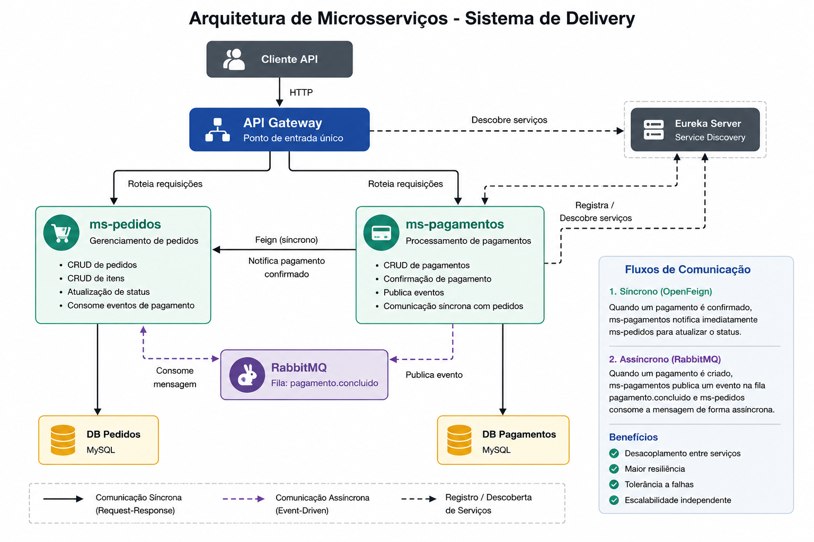

# Sistema de Delivery - Arquitetura de Microsserviços

Este projeto implementa um sistema backend para delivery utilizando arquitetura de microsserviços com Java e Spring Cloud. O objetivo é demonstrar comunicação entre serviços, separação de responsabilidades, resiliência e boas práticas em sistemas distribuídos.

---

# Tecnologias Principais

- Java 21
- Spring Boot 3
- Spring Cloud
- Spring Cloud Gateway
- Eureka Server
- OpenFeign
- RabbitMQ
- MySQL
- Flyway
- Docker & Docker Compose
- Maven
- OpenAPI (Swagger)

---

# Arquitetura de Microsserviços

O sistema é composto por quatro componentes principais:

- API Gateway
- Eureka Server
- Microsserviço de Pedidos
- Microsserviço de Pagamentos

<p align="center">
  
</p>

---

# Componentes

## Eureka Server (`eureka`)

Responsável pelo registro e descoberta de serviços.

Todos os microsserviços se registram automaticamente no Eureka, permitindo descoberta dinâmica sem necessidade de configurar IPs ou portas manualmente.

---

## API Gateway (`gateway`)

Responsável por centralizar todas as requisições externas.

Funções principais:

- Roteamento de requisições
- Integração com Eureka
- Balanceamento de carga
- Ponto único de entrada da aplicação

---

## Microsserviço de Pedidos (`ms-pedidos`)

Responsável pelo gerenciamento do ciclo de vida dos pedidos.

### Responsabilidades

- CRUD de pedidos
- CRUD de itens do pedido
- Atualização de status
- Consumo de eventos do RabbitMQ

### Comunicação

- Exposição de API REST
- Consumo de mensagens assíncronas de pagamento

---

## Microsserviço de Pagamentos (`ms-pagamentos`)

Responsável pelo processamento dos pagamentos.

### Responsabilidades

- CRUD de pagamentos
- Confirmação de pagamento
- Publicação de eventos

### Comunicação

- Exposição de API REST
- Publicação de mensagens no RabbitMQ
- Comunicação síncrona com `ms-pedidos` via OpenFeign

---

# Padrões de Comunicação

O projeto utiliza comunicação síncrona e assíncrona entre microsserviços.

---

## Comunicação Síncrona

### Tecnologia

- OpenFeign

### Fluxo

```text
ms-pagamentos -> ms-pedidos
```

### Caso de uso

Quando um pagamento é confirmado, o serviço de pagamentos notifica imediatamente o serviço de pedidos para atualizar o status do pedido para `PAGO`.

### Estratégia de Compensação

Caso a comunicação falhe, o serviço reverte o status do pagamento para evitar inconsistência entre os microsserviços.

---

## Comunicação Assíncrona

### Tecnologia

- RabbitMQ

### Fluxo

```text
ms-pagamentos -> RabbitMQ -> ms-pedidos
```

### Caso de uso

Ao criar um pagamento, o serviço publica um evento na fila `pagamento.concluido`.

### Benefícios

- Desacoplamento entre serviços
- Maior resiliência
- Processamento assíncrono
- Tolerância a falhas

---

# Banco de Dados

## MySQL

Cada microsserviço possui seu próprio banco de dados.

### Migrações

O versionamento do schema é realizado com Flyway.

Localização dos scripts:

```text
src/main/resources/db/migration
```

---

# Tratamento de Erros

O projeto utiliza o padrão:

```text
RFC 7807 - Problem Details for HTTP APIs
```

Cada microsserviço possui um `@RestControllerAdvice` responsável por padronizar respostas de erro.

### Estrutura da resposta

- `type`
- `title`
- `status`
- `detail`
- `instance`
- `timestamp`
- erros de validação

---

# Documentação da API

A documentação é gerada utilizando OpenAPI (Swagger).

## Swagger - Pedidos

```text
http://localhost:8080/ms-pedidos/swagger-ui/index.html
```

## Swagger - Pagamentos

```text
http://localhost:8080/ms-pagamentos/swagger-ui/index.html
```

---

# Como Executar o Projeto

## Pré-requisitos

- Java 21+
- Maven 3.8+
- Docker
- Docker Compose

---

## 1. Subir infraestrutura

```bash
docker-compose up -d
```

### Serviços disponíveis

- MySQL → `localhost:3306`
- RabbitMQ → `http://localhost:15672`

```text
Usuário: rabbitmq
Senha: root123
```

---

## 2. Compilar os projetos

```bash
mvn clean install
```

---

## 3. Executar os microsserviços

### Eureka Server

```bash
java -jar eureka/target/eureka-server-0.0.1-SNAPSHOT.jar
```

### API Gateway

```bash
java -jar gateway/target/gateway-0.0.1-SNAPSHOT.jar
```

### MS Pedidos

```bash
java -jar ms-pedidos/target/ms-pedidos-0.0.1-SNAPSHOT.jar
```

### MS Pagamentos

```bash
java -jar ms-pagamentos/target/pagamentos-0.0.1-SNAPSHOT.jar
```

---

## 4. Verificar registro dos serviços

Acesse:

```text
http://localhost:8761
```

Os seguintes serviços deverão aparecer registrados:

- GATEWAY
- MS-PEDIDOS
- MS-PAGAMENTOS

---